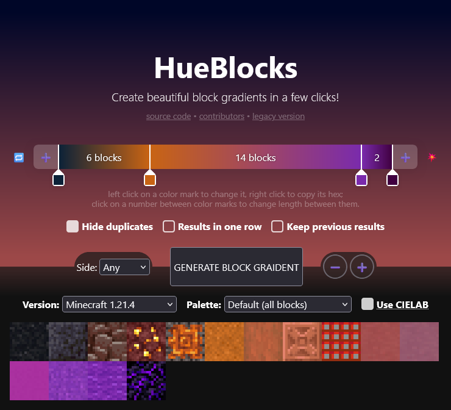

  <a href="https://1280px.github.io/hueblocks/">
     
  </a>
  <i>Create beautiful block gradients in a few clicks!</i>

<b>HueBlocks is an online Minecraft block gradients generator.</b>
 It's simple: pick colours or blocks you want, set amount of blocks between them, press the Big Black Button et voila!

Additionally, you can:
- Choose Minecraft Java Edition version which blocks you're interested in
- Use palettes to generate gradients using only specific sets of blocks, or even create your own palettes and share them with others via JSON import/export tool
- Filter textures by their facing (for example, if you're building a house wall, you're probably not that interested in blocks that only have a fitting texture on their top side)
- Switch between RGB and OkLAB colourspaces
- *and more!*
<!-- - Choose blocks noise threshold, allowing to filter out too "smooth" (like concrete) or, more commonly, too "noisy" blocks (crafting tables, glazed terracotta, TNT, you name it) -->
<!-- - Upload and use custom textures right from your browser, without any need to mess with backend -->

By default, HB comes with blocks from three MCJE versions — **1.8.9**, **1.13.2** (last version before Texture Update), and **latest stable MCJE** (1.21.11 as of Jan '26). *If you need other versions, you can fork a repo and host an instance with your own blocksets, either by putting their JAR files through jar2blockset script, or by re-creating blockset structure yourself.*

***Please note that not every single texture is included!*** All blocks with fully transparent pixels (i.e. flowers or trapdoors — but not semi-opaque blocks like stained glass), biome-/foliage-affected (such as grass and leaves), and overly-similar looking blocks were scrapped for the sake of better gradient appearance. *All of these paramaters, as well as palette presets, are fully configurable on backend side, so you can easily tweak it for your need on your instance.*

> [!TIP]
> Looking for older version? It's available at https://1280px.github.io/hueblocks-legacy

# List of Changes

Apart from being re-written on modern tech stack (Vue 3 + TS for frontend, Python 3.12 for backend), thus improved frontend modularity and MUCH better backend flexibility and configurability, HueBlocks New also introduces new very interesting features, and revamps some of the original ones.

### Added features

1. **Multicolour colourbar** — the feature that had started it all. Now you're not limited to using just 2 colours at once! The entire gradient now consisnts of as many points ("colour tags") as you like, with arbitrary lengths in between. Just like before, for each colour tag you can pick either colours or blocks, swap the entire gradient from left to right, and randomise colour values if you want to have some fun.
2. **Colourspace switcher** — depending on your needs, you may want to have either very smooth or very contrast gradients. For such cases, you can use a switcher between SRGB (the only colour space featured in HueBlocks Legacy) and ~~CIELAB~~ OkLAB (used by default). Please keep in mind there is no a "better" or a "worse" colourspace, sometimes the best choice will be checking both — conveniently, switching between them is as simple as clicking a single "Use OkLAB" box.
3. **Filter by facing** — quite often there are situations, when the "best" suggested gradient uses textures that cannot co-exist in the same side (e.g. a furnace top and a loom sides). To solve this, now, using the switch with a block pictogram on it, you can manually set the side(-s) you're interested in, and HBN will only use the applicable textures.

### Improved features

1. **Proper version selection support** — instead of two hardcoded blocksets that require manual update, HBN allows adding new Minecraft Java Edition versions as simple as providing their JARs to a jar2blockset utility. Extraction, filtering, colour and sides calculation, naming... everything is automated, and is also configurable in YAML files.
2. **Improved custom palettes** — now you can edit any built-in palette you want (including custom palettes you created before), and easily import and export palettes as JSON.
3. **Keep previous results**, because of a new colourbar, now shows different results not in the same row but in other rows, allowing easily comparing results of using different blocks or switching between colourspaces.
4. **Colour calculation improvements** — apart from addition of OkLAB colour calculations, SRGB calculation was improved as well. So, even though I tried to preserve SRGB calculation as close to original as possible, now the SRGB average block colours should be extracted more accurately.
5. **Better adaptiveness**, allowing for a better experience when using HueBlocks from a phone.

### Not there yet

1. **Custom blocksets** — The only feature missing from legacy version. I expect them to land some time before June 15th, when I'll have more free time. Feel free to make a PR if you wish to see them sooner!
2. **Block noise calculation** — Finally, a way to distinguish between block "good" and "bad" for building. This is a feature I'm very excited implementing about, even though it's not there yet I hope to finish it in a coming months as well. By setting a "threshold" for observed texture variation (which will be computed backend-side), you will be able to filter "smooth" blocks from "noisy" blocks to the exact extent you want.

# Technical Details

HueBlocks consists of two parts — a Vue SPA web app (`vueblocks`) and a Python blocksets data generator (`jar2blockset`). Just like the legacy version, it has no actual back-end — all textures are downloaded, extracted and processed using Github Actions after every push, and then stored on their servers instead.

For each of these parts, there is a separate README with more details and documentation. So:
- If you want to create blocksets from your own textures or change generation configs (i.e. to include semi-transparent blocks, use custom palettes or edit textures blacklist) — [check this](https://github.com/1280px/hueblocks/tree/master/jar2blockset#readme),
- And if you want to mess with web app (it's very modular by design, so, if you know Vue 3, even something as creating a whole new separate mode shouldn't take much time) — [check that](https://github.com/1280px/hueblocks/tree/master/vueblocks#readme).

Additionally, if you're interested in color theory behind most of calculations, **I highly recommend  checking out Gneiss Name channel on YouTube**. His videos have greatly helped me refresh my memory on the basics, and also were great introductions to some topics I didn't understand before. 
 In particular, I recommend watching these episodes as sort of QnA:
- [What is OkLAB, and how is it different from (s)RGB?](https://www.youtube.com/watch?v=nJlZT5AE9zY)
  - [If you're very new to colourspaces, watch this first](https://www.youtube.com/watch?v=2kDuYv3ocxU)
- [What's the purpose of taking sqrt of squares for averaging block colour?](https://www.youtube.com/watch?v=e0HM_vfSuDw)
- [How exactly is block texture noise calculated?](https://www.youtube.com/watch?v=4meYZQZFuaA)
  - [Another technique of getting "denoised" texture averages](https://www.youtube.com/watch?v=HuW9qJbL0xM)

You can also check the j2bs source code for additional sources, commented right next to the code itself.

# Legal Notice

All the textures data provided by the Github Pages version are live extracted and processed from client JAR files live downloaded from Mojang's [Piston Meta servers API](https://gist.github.com/skyrising/95a8e6a7287634e097ecafa2f21c240f) using HTTP calls, and NOT provided in the repository itself. All rights on both the JAR files and the textures belong to Mojang Studios, and used for demonstration purposes only!
