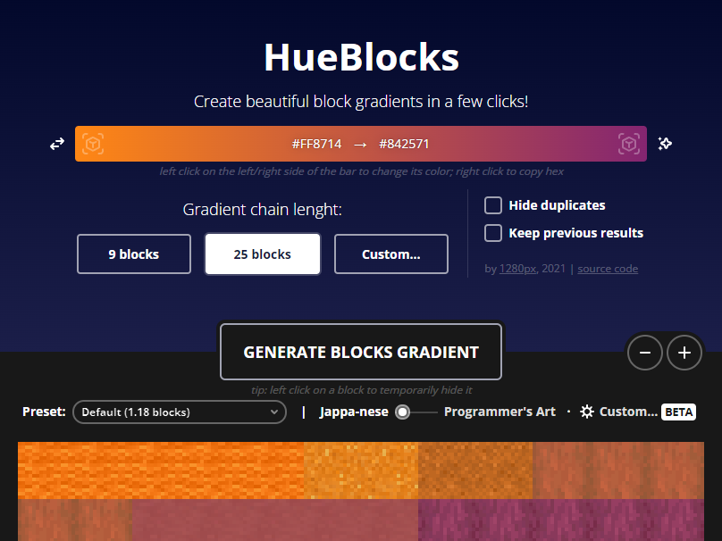

# This public version was uploaded to test and complete Github Actions logic. It is not finished _yet_, so it will probably not even work! I'll remove this message when it'll be ready for use.

    
    <i>Create beautiful block gradients in a few clicks!</i>

